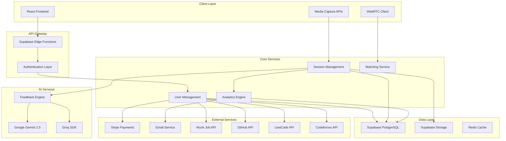

# Design Document: AI Interview Platform

## Overview

The Voke AI-powered interview preparation platform is a comprehensive web application that combines multiple interview practice modes with advanced AI feedback systems. The platform leverages modern web technologies, AI services, and real-time communication to provide personalized interview coaching experiences.

The system architecture follows a modern full-stack approach with React/TypeScript frontend, Supabase backend-as-a-service, and integration with multiple AI providers (Google Gemini, Groq) for intelligent feedback and coaching capabilities.

## Architecture

### High-Level Architecture



### Technology Stack

**Frontend:**
- React 18 with TypeScript for type safety and modern development
- Vite for fast development and optimized builds
- Tailwind CSS for utility-first styling
- shadcn/ui for consistent component library
- WebRTC for peer-to-peer video communication
- Web APIs for media capture and processing

**Backend:**
- Supabase as Backend-as-a-Service providing:
  - PostgreSQL database with real-time subscriptions
  - Authentication and authorization
  - File storage for video/audio recordings
  - Edge Functions for serverless compute
- Redis for session caching and real-time features

**AI Integration:**
- Google Gemini 2.5 Flash for content analysis and feedback generation
- Groq SDK for real-time voice processing and conversation
- Custom feedback algorithms for performance scoring

**Infrastructure:**
- Vercel for frontend deployment and edge computing
- Supabase Cloud for managed backend services
- CDN for global content delivery
- Monitoring and analytics integration

## Components and Interfaces

### Core Components

#### 1. Profile Analysis Engine
Analyzes GitHub repositories and resume content for personalized question generation - the platform's core USP.

```typescript
interface ProfileAnalysisEngine {
  analyzeGitHubProfile(githubUrl: string): Promise<GitHubAnalysis>
  parseResumeContent(resumeFile: File): Promise<ResumeAnalysis>
  generatePersonalizedQuestions(analysis: ProfileAnalysis): Promise<PersonalizedQuestion[]>
  assessSkillLevel(skills: ExtractedSkill[]): Promise<SkillLevelAssessment>
  matchQuestionDifficulty(userLevel: SkillLevel, questions: Question[]): Promise<Question[]>
}

interface GitHubAnalysis {
  repositories: RepositoryAnalysis[]
  languages: LanguageUsage[]
  complexity: ComplexityMetrics
  contributions: ContributionPattern
  skills: ExtractedSkill[]
}

interface ResumeAnalysis {
  extractedSkills: ExtractedSkill[]
  experience: ExperienceEntry[]
  achievements: Achievement[]
  education: EducationEntry[]
  projects: ProjectEntry[]
}

interface PersonalizedQuestion extends Question {
  relevanceReason: string
  specificContext: string
  expectedDepth: QuestionDepth
  relatedProjects: string[]
}
```

#### 2. Coding Platform Integration
Integrates with LeetCode and Codeforces to assess coding skills and adjust difficulty.

```typescript
interface CodingPlatformIntegration {
  connectLeetCodeProfile(userId: string, leetcodeUsername: string): Promise<LeetCodeProfile>
  connectCodeforcesProfile(userId: string, codeforcesHandle: string): Promise<CodeforcesProfile>
  analyzeCodingSkills(profiles: CodingProfile[]): Promise<CodingSkillAssessment>
  recommendTechnicalQuestions(skillLevel: CodingSkillLevel): Promise<TechnicalQuestion[]>
  trackPerformanceCorrelation(userId: string): Promise<PerformanceCorrelation>
}

interface LeetCodeProfile {
  username: string
  totalSolved: number
  easySolved: number
  mediumSolved: number
  hardSolved: number
  acceptanceRate: number
  ranking: number
  recentSubmissions: Submission[]
}

interface CodeforcesProfile {
  handle: string
  rating: number
  maxRating: number
  rank: string
  contestsParticipated: number
  problemsSolved: number
  recentContests: ContestResult[]
}
```

#### 3. Session Manager
Orchestrates all types of interview sessions and manages state transitions.

```typescript
interface SessionManager {
  createSession(type: SessionType, config: SessionConfig): Promise<Session>
  startSession(sessionId: string): Promise<void>
  pauseSession(sessionId: string): Promise<void>
  endSession(sessionId: string): Promise<SessionResult>
  getActiveSession(userId: string): Promise<Session | null>
}

interface Session {
  id: string
  userId: string
  type: SessionType
  status: SessionStatus
  startTime: Date
  endTime?: Date
  config: SessionConfig
  responses: Response[]
  feedback?: Feedback
}

type SessionType = 'video' | 'voice' | 'text' | 'peer'
type SessionStatus = 'created' | 'active' | 'paused' | 'completed' | 'cancelled'
```

#### 4. AI Feedback Engine
Processes user responses and generates personalized feedback using AI services.

```typescript
interface FeedbackEngine {
  analyzeVideoResponse(videoData: Blob, question: string): Promise<VideoFeedback>
  analyzeVoiceResponse(audioData: Blob, context: string): Promise<VoiceFeedback>
  analyzeTextResponse(text: string, question: string): Promise<TextFeedback>
  generateImprovementPlan(userId: string): Promise<ImprovementPlan>
}

interface VideoFeedback {
  bodyLanguage: BodyLanguageAnalysis
  eyeContact: EyeContactAnalysis
  facialExpressions: FacialExpressionAnalysis
  overallScore: number
  recommendations: string[]
}

interface VoiceFeedback {
  clarity: number
  pace: number
  confidence: number
  contentRelevance: number
  suggestions: string[]
}

interface TextFeedback {
  structure: number
  relevance: number
  completeness: number
  clarity: number
  keyPoints: string[]
  improvements: string[]
}
```

#### 5. User Management System
Handles user authentication, profiles, and subscription management.

```typescript
interface UserManager {
  createUser(userData: CreateUserRequest): Promise<User>
  updateProfile(userId: string, updates: ProfileUpdate): Promise<User>
  getUser(userId: string): Promise<User>
  updateSubscription(userId: string, plan: SubscriptionPlan): Promise<Subscription>
  checkFeatureAccess(userId: string, feature: Feature): Promise<boolean>
}

interface User {
  id: string
  email: string
  profile: UserProfile
  subscription: Subscription
  preferences: UserPreferences
  createdAt: Date
  lastActive: Date
}

interface UserProfile {
  firstName: string
  lastName: string
  targetRole: string
  experienceLevel: ExperienceLevel
  careerGoals: string[]
  skills: string[]
}
```

#### 6. Analytics Dashboard
Tracks user progress and generates insights for improvement.

```typescript
interface AnalyticsDashboard {
  getUserMetrics(userId: string, timeRange: TimeRange): Promise<UserMetrics>
  getProgressTrends(userId: string): Promise<ProgressTrend[]>
  generateInsights(userId: string): Promise<Insight[]>
  compareWithPeers(userId: string): Promise<PeerComparison>
}

interface UserMetrics {
  totalSessions: number
  averageScore: number
  improvementRate: number
  streakDays: number
  skillBreakdown: SkillMetric[]
  recentActivity: ActivitySummary[]
}

interface ProgressTrend {
  skill: string
  dataPoints: { date: Date; score: number }[]
  trend: 'improving' | 'stable' | 'declining'
}
```

#### 7. Peer Matching Service
Connects users for peer interview practice sessions.

```typescript
interface PeerMatchingService {
  findMatch(userId: string, preferences: MatchPreferences): Promise<Match | null>
  createPeerSession(match: Match): Promise<PeerSession>
  handleSessionEnd(sessionId: string, feedback: MutualFeedback): Promise<void>
  updateUserRating(userId: string, rating: number): Promise<void>
}

interface Match {
  user1: string
  user2: string
  compatibility: number
  preferences: MatchPreferences
  estimatedWaitTime: number
}

interface PeerSession extends Session {
  participants: [string, string]
  currentInterviewer: string
  webrtcConnection: WebRTCConnection
  mutualFeedback?: MutualFeedback
}
```

#### 8. Learning Path Engine
Manages structured learning experiences and adaptive content delivery.

```typescript
interface LearningPathEngine {
  getAvailablePaths(userId: string): Promise<LearningPath[]>
  enrollUser(userId: string, pathId: string): Promise<Enrollment>
  getNextActivity(userId: string, pathId: string): Promise<Activity>
  recordCompletion(userId: string, activityId: string, result: ActivityResult): Promise<void>
  generateCertificate(userId: string, pathId: string): Promise<Certificate>
}

interface LearningPath {
  id: string
  title: string
  description: string
  targetRole: string
  difficulty: Difficulty
  estimatedDuration: number
  modules: Module[]
  prerequisites: string[]
}

interface Module {
  id: string
  title: string
  activities: Activity[]
  requiredScore: number
  unlockConditions: UnlockCondition[]
}
```

#### 9. Job Matching Engine
Integrates with Mush API to provide intelligent job recommendations based on interview performance.

```typescript
interface JobMatchingEngine {
  calculateInterviewScore(userId: string): Promise<InterviewScore>
  fetchJobOpportunities(criteria: JobCriteria): Promise<JobListing[]>
  matchJobsToUser(userId: string): Promise<JobMatch[]>
  rankJobsByCompatibility(jobs: JobListing[], userProfile: UserProfile): Promise<RankedJob[]>
  notifyNewMatches(userId: string): Promise<void>
}

interface JobMatch {
  job: JobListing
  compatibilityScore: number
  matchReasons: string[]
  requiredSkills: string[]
  skillGaps: string[]
}

interface InterviewScore {
  overall: number
  technical: number
  behavioral: number
  communication: number
  confidence: number
  breakdown: SkillScore[]
}
```

#### 10. Question Bank Manager
Manages the comprehensive library of 1800+ interview questions with advanced categorization.

```typescript
interface QuestionBankManager {
  getQuestionsByCategory(category: QuestionCategory, filters: QuestionFilters): Promise<Question[]>
  getCompanyQuestions(companyId: string, role?: string): Promise<CompanyQuestion[]>
  searchQuestions(query: string, filters: QuestionFilters): Promise<Question[]>
  trackQuestionPerformance(userId: string, questionId: string, performance: QuestionPerformance): Promise<void>
  recommendQuestions(userId: string, count: number): Promise<Question[]>
  addUserContribution(question: UserContributedQuestion): Promise<void>
}

interface CompanyQuestion extends Question {
  company: string
  year: number
  interviewRound: 'screening' | 'technical' | 'behavioral' | 'final'
  verified: boolean
  difficulty: Difficulty
}

interface QuestionFilters {
  difficulty?: Difficulty[]
  categories?: string[]
  companies?: string[]
  skills?: string[]
  timeRange?: TimeRange
}
```

#### 11. AI Playground Assistant
Provides interactive coaching and guidance in the playground environment.

```typescript
interface PlaygroundAssistant {
  startPlaygroundSession(userId: string): Promise<PlaygroundSession>
  processUserMessage(sessionId: string, message: string): Promise<AssistantResponse>
  provideInterviewTip(context: InterviewContext): Promise<InterviewTip>
  suggestPracticeArea(userId: string): Promise<PracticeRecommendation>
  analyzeUserProgress(userId: string): Promise<ProgressInsight[]>
}

interface PlaygroundSession {
  id: string
  userId: string
  startTime: Date
  conversationHistory: ConversationMessage[]
  currentContext: InterviewContext
  assistantPersonality: AssistantPersonality
}

interface AssistantResponse {
  message: string
  suggestions: string[]
  resources: Resource[]
  nextSteps: string[]
}
```

### External Service Interfaces

#### AI Service Integration
```typescript
interface AIServiceProvider {
  analyzeContent(content: string, type: AnalysisType): Promise<AnalysisResult>
  generateQuestions(context: QuestionContext): Promise<Question[]>
  processVoiceInput(audioData: Blob): Promise<VoiceProcessingResult>
  generateVoiceResponse(text: string, voice: VoiceConfig): Promise<AudioBlob>
}

interface GeminiProvider extends AIServiceProvider {
  model: 'gemini-2.5-flash'
  maxTokens: number
  temperature: number
}

interface GroqProvider extends AIServiceProvider {
  model: string
  realTimeProcessing: boolean
  latencyOptimized: boolean
}
```

## Data Models

### Core Entities

#### User Data Model
```typescript
interface User {
  id: string                    // UUID primary key
  email: string                 // Unique email address
  passwordHash?: string         // Hashed password (optional for OAuth)
  profile: UserProfile
  subscription: Subscription
  preferences: UserPreferences
  stats: UserStats
  createdAt: Date
  updatedAt: Date
  lastLoginAt: Date
}

interface UserProfile {
  firstName: string
  lastName: string
  avatarUrl?: string
  targetRole: string
  experienceLevel: 'entry' | 'mid' | 'senior' | 'executive'
  industry: string
  location?: string
  careerGoals: string[]
  skills: Skill[]
  resume?: ResumeData
}

interface Subscription {
  plan: 'free' | 'basic' | 'premium' | 'enterprise'
  status: 'active' | 'cancelled' | 'expired' | 'trial'
  startDate: Date
  endDate?: Date
  stripeCustomerId?: string
  stripeSubscriptionId?: string
}
```

#### Session Data Model
```typescript
interface Session {
  id: string
  userId: string
  type: SessionType
  status: SessionStatus
  config: SessionConfig
  startTime: Date
  endTime?: Date
  duration?: number             // in seconds
  responses: Response[]
  feedback?: Feedback
  score?: number
  metadata: SessionMetadata
}

interface Response {
  id: string
  sessionId: string
  questionId: string
  content: ResponseContent
  timestamp: Date
  duration: number
  score?: number
}

interface ResponseContent {
  text?: string
  audioUrl?: string
  videoUrl?: string
  metadata: {
    fileSize?: number
    duration?: number
    quality?: string
  }
}
```

#### Question Bank Model
```typescript
interface Question {
  id: string
  category: QuestionCategory
  difficulty: Difficulty
  text: string
  followUpQuestions?: string[]
  expectedKeywords: string[]
  scoringCriteria: ScoringCriteria
  metadata: QuestionMetadata
  companySpecific?: CompanyQuestionData
}

interface CompanyQuestionData {
  company: string
  year: number
  interviewRound: InterviewRound
  verified: boolean
  verificationCount: number
  successRate: number
}

interface QuestionCategory {
  name: string
  subcategory?: string
  targetRoles: string[]
  skills: string[]
}

interface ScoringCriteria {
  contentRelevance: number      // weight 0-1
  structureClarity: number      // weight 0-1
  completeness: number          // weight 0-1
  keywordMatching: number       // weight 0-1
}
```

#### Profile Analysis Data Model
```typescript
interface ProfileAnalysis {
  userId: string
  githubAnalysis?: GitHubAnalysis
  resumeAnalysis?: ResumeAnalysis
  codingPlatforms: CodingPlatformData[]
  skillLevelAssessment: SkillLevelAssessment
  personalizedQuestions: PersonalizedQuestion[]
  lastUpdated: Date
}

interface GitHubAnalysis {
  username: string
  repositories: RepositoryData[]
  languages: LanguageUsage[]
  totalCommits: number
  complexity: ComplexityMetrics
  skills: ExtractedSkill[]
  projectTypes: ProjectType[]
}

interface RepositoryData {
  name: string
  description: string
  language: string
  stars: number
  complexity: number
  technologies: string[]
  lastActivity: Date
}

interface CodingPlatformData {
  platform: 'leetcode' | 'codeforces'
  username: string
  rating: number
  problemsSolved: number
  skillLevel: CodingSkillLevel
  strengths: string[]
  weaknesses: string[]
}

interface SkillLevelAssessment {
  overall: SkillLevel
  technical: SkillLevel
  algorithmic: SkillLevel
  systemDesign: SkillLevel
  breakdown: SkillBreakdown[]
}
```

#### Job Matching Data Model
```typescript
interface JobListing {
  id: string
  title: string
  company: string
  description: string
  requirements: JobRequirement[]
  skills: RequiredSkill[]
  experienceLevel: ExperienceLevel
  location: string
  salary?: SalaryRange
  postedDate: Date
  source: 'mush' | 'direct'
}

interface JobMatch {
  jobId: string
  userId: string
  compatibilityScore: number
  matchReasons: MatchReason[]
  skillAlignment: SkillAlignment
  interviewReadiness: number
  recommendationStrength: 'high' | 'medium' | 'low'
  createdAt: Date
}

interface SkillAlignment {
  matchedSkills: string[]
  missingSkills: string[]
  overqualifiedSkills: string[]
  alignmentPercentage: number
}
```

#### Playground Session Data Model
```typescript
interface PlaygroundSession {
  id: string
  userId: string
  startTime: Date
  endTime?: Date
  conversationHistory: PlaygroundMessage[]
  topicsDiscussed: string[]
  tipsProvided: InterviewTip[]
  practiceAreas: string[]
  sessionSummary?: SessionSummary
}

interface PlaygroundMessage {
  id: string
  sender: 'user' | 'assistant'
  content: string
  timestamp: Date
  messageType: 'question' | 'tip' | 'feedback' | 'general'
  relatedTopics: string[]
}

interface InterviewTip {
  id: string
  category: TipCategory
  title: string
  content: string
  applicableScenarios: string[]
  difficulty: Difficulty
  effectiveness: number
}
```

#### Analytics Data Model
```typescript
interface UserMetrics {
  userId: string
  date: Date
  sessionsCompleted: number
  averageScore: number
  timeSpent: number             // in minutes
  skillScores: SkillScore[]
  improvementAreas: string[]
  achievements: Achievement[]
}

interface SkillScore {
  skill: string
  score: number                 // 0-100
  trend: 'improving' | 'stable' | 'declining'
  sessionsCount: number
  lastUpdated: Date
}

interface Achievement {
  id: string
  type: 'streak' | 'score' | 'completion' | 'improvement'
  title: string
  description: string
  earnedAt: Date
  badgeUrl?: string
}
```

#### Learning Path Data Model
```typescript
interface LearningPath {
  id: string
  title: string
  description: string
  targetRole: string
  difficulty: Difficulty
  estimatedHours: number
  modules: Module[]
  prerequisites: string[]
  completionRate: number
  rating: number
  createdAt: Date
  updatedAt: Date
}

interface Module {
  id: string
  pathId: string
  title: string
  description: string
  order: number
  activities: Activity[]
  requiredScore: number
  unlockConditions: UnlockCondition[]
}

interface Activity {
  id: string
  moduleId: string
  type: ActivityType
  title: string
  description: string
  content: ActivityContent
  estimatedMinutes: number
  requiredForCompletion: boolean
}

type ActivityType = 'video_practice' | 'voice_session' | 'text_interview' | 'reading' | 'quiz'
```

### Database Schema Considerations

#### Indexing Strategy
- Primary keys on all entities (UUID)
- Composite indexes on frequently queried combinations:
  - (userId, sessionType, createdAt) for session queries
  - (userId, date) for analytics queries
  - (targetRole, difficulty) for question filtering
- Full-text search indexes on question content and user profiles

#### Data Partitioning
- Sessions partitioned by date for efficient archival
- Analytics data partitioned by month for performance
- User data kept in single partition for consistency

#### Caching Strategy
- User profiles and preferences cached in Redis
- Question banks cached with TTL of 1 hour
- Session state cached during active sessions
- Analytics summaries cached with daily refresh

## Correctness Properties

*A property is a characteristic or behavior that should hold true across all valid executions of a system—essentially, a formal statement about what the system should do. Properties serve as the bridge between human-readable specifications and machine-verifiable correctness guarantees.*

### Property 1: GitHub Repository Analysis and Question Generation
*For any* valid GitHub profile URL, the system should analyze repositories, extract technical skills and project complexity, and generate personalized interview questions based on specific code and projects.
**Validates: Requirements 1.1, 1.2, 1.4, 1.6**

### Property 2: Resume Content Analysis and Skill Extraction
*For any* uploaded resume, the AI should accurately parse content, extract claimed skills and experience, and generate relevant interview questions that test specific claims and achievements.
**Validates: Requirements 1.3, 1.4, 1.5**

### Property 3: Coding Platform Integration and Skill Assessment
*For any* connected LeetCode or Codeforces profile, the system should fetch accurate statistics, assess technical skill level, and adjust interview question difficulty appropriately.
**Validates: Requirements 2.1, 2.2, 2.3, 2.4**

### Property 4: Question Difficulty Matching
*For any* user with analyzed coding platform progress and GitHub/resume data, the system should match technical interview questions to appropriate difficulty levels based on demonstrated capabilities.
**Validates: Requirements 1.5, 2.4**

### Property 5: Session Creation and Initialization
*For any* valid user and session type (video, voice, text, peer), creating a session should result in proper initialization with camera/microphone activation, question display, and session state tracking.
**Validates: Requirements 3.1, 4.1, 5.1, 6.1**

### Property 6: AI Analysis Completeness
*For any* user response (video, voice, or text), the AI analysis should process all required aspects (body language for video, clarity for voice, structure for text) and generate feedback within specified time limits.
**Validates: Requirements 3.3, 3.4, 4.5, 5.5**

### Property 7: Data Persistence and Security
*For any* user data (sessions, responses, profile information), the system should store it securely with encryption and allow retrieval while maintaining data integrity.
**Validates: Requirements 3.5, 5.4, 11.4**

### Property 8: Real-time Updates and Performance
*For any* user action that should trigger updates (session completion, challenge completion, profile changes), the system should update relevant metrics and displays within specified time limits (5-10 seconds).
**Validates: Requirements 7.2, 10.2, 11.5**

### Property 9: Media Quality and Processing
*For any* media capture (video recording, voice input), the system should maintain minimum quality standards (720p for video, 95% accuracy for speech-to-text) and process the content appropriately.
**Validates: Requirements 3.2, 4.3**

### Property 10: Adaptive Content Generation
*For any* user profile and context, the AI should generate personalized content (questions, learning paths, recommendations) that matches the user's target role, experience level, and preferences.
**Validates: Requirements 5.1, 8.6, 9.5**

### Property 11: Timer and Progression Management
*For any* timed activity (text interviews, session durations), the system should accurately track time, provide real-time feedback, and automatically progress when time expires.
**Validates: Requirements 5.2, 5.3, 5.4**

### Property 12: Peer Matching and Connection
*For any* peer practice request, the system should either find a suitable match within 60 seconds or queue the user, then establish a working WebRTC connection between matched users.
**Validates: Requirements 6.1, 6.2**

### Property 13: Role Management and Session Control
*For any* peer session, the system should properly assign and manage interviewer/interviewee roles, allow role switching, and maintain session state throughout the interaction.
**Validates: Requirements 6.3, 6.4**

### Property 14: Feedback Collection and Processing
*For any* completed session (individual or peer), the system should collect appropriate feedback, process it for insights, and use it to improve future recommendations and matching.
**Validates: Requirements 6.5, 6.6**

### Property 15: Analytics and Trend Analysis
*For any* user with session history, the analytics system should accurately calculate metrics, identify trends, and generate actionable insights for improvement.
**Validates: Requirements 7.1, 7.3, 7.4, 7.5**

### Property 16: Learning Path Progression
*For any* user enrolled in a learning path, the system should track progress, unlock content based on performance, and provide certificates upon module completion.
**Validates: Requirements 8.2, 8.3, 8.4, 8.5**

### Property 17: Resume Processing and Optimization
*For any* resume content input, the system should provide real-time suggestions, analyze against job descriptions, and generate multiple export formats correctly.
**Validates: Requirements 9.2, 9.3, 9.4**

### Property 18: Community Engagement and Moderation
*For any* community interaction (challenges, forums, achievements), the system should properly track participation, award recognition, and moderate content to maintain a professional environment.
**Validates: Requirements 10.1, 10.3, 10.5, 10.6**

### Property 19: Authentication and Profile Management
*For any* authentication method (email, Google, LinkedIn), the system should properly verify users, enforce email verification, and allow profile customization with appropriate data handling.
**Validates: Requirements 11.1, 11.2, 11.3**

### Property 20: Subscription and Access Control
*For any* user subscription tier, the system should properly control feature access, handle upgrades/downgrades immediately, and manage payment processing securely.
**Validates: Requirements 12.1, 12.3, 12.4, 12.5, 12.6**

### Property 21: Error Handling and User Experience
*For any* system error or unclear input, the system should provide helpful error messages, recovery options, and appropriate user feedback to maintain a smooth experience.
**Validates: Requirements 4.4, 13.3, 13.5**

### Property 22: Responsive Design and Accessibility
*For any* device type or accessibility need, the system should provide appropriate responsive layouts, touch interactions, keyboard navigation, and assistive technology support.
**Validates: Requirements 14.1, 14.2, 14.3, 14.5, 14.6**

### Property 23: Adaptive Quality Optimization
*For any* network or device constraints, the system should optimize media quality (video/audio) and page load performance to maintain usability across different conditions.
**Validates: Requirements 13.1, 14.4**

### Property 24: Data Export and Privacy Compliance
*For any* user data export request, the system should generate complete, accurate exports in standard formats while maintaining privacy compliance and data integrity.
**Validates: Requirements 9.4, 11.6**

### Property 25: Job Matching Based on Interview Performance
*For any* user with completed interview sessions, the job matching engine should calculate accurate performance scores and recommend relevant jobs from Mush API that align with demonstrated capabilities.
**Validates: Requirements 15.1, 15.2, 15.3, 15.4**

### Property 26: Comprehensive Question Bank Access and Filtering
*For any* user search or filter request, the system should provide access to the 1800+ question library with accurate categorization, difficulty levels, and company-specific filtering.
**Validates: Requirements 16.1, 16.2, 16.3, 16.5**

### Property 27: AI Playground Assistant Interaction
*For any* user interaction in the playground mode, the AI assistant should provide contextually relevant guidance, tips, and coaching while maintaining conversation continuity.
**Validates: Requirements 17.1, 17.2, 17.3, 17.5**

### Property 28: Company-Specific Question Organization
*For any* company selection, the system should provide accurately organized previous year questions with proper categorization by role, year, and interview round.
**Validates: Requirements 18.1, 18.2, 18.3, 18.4**

### Property 29: Job Notification and Matching Updates
*For any* new job opportunities that match user criteria, the system should notify users within specified timeframes and provide detailed compatibility explanations.
**Validates: Requirements 15.5, 15.6**

### Property 30: Question Performance Tracking and Recommendations
*For any* user practice history, the system should track performance on individual questions and recommend new questions based on weak areas and improvement needs.
**Validates: Requirements 16.4, 16.5**

## Error Handling

### Error Categories and Strategies

#### 1. AI Service Failures
- **Timeout Handling**: Implement circuit breakers for AI service calls with fallback to cached responses
- **Rate Limiting**: Handle API rate limits gracefully with queuing and retry mechanisms
- **Service Degradation**: Provide alternative feedback when AI services are unavailable

#### 2. Media Processing Errors
- **Camera/Microphone Access**: Graceful fallback when permissions are denied
- **Recording Failures**: Automatic retry with quality degradation if needed
- **Upload Failures**: Chunked upload with resume capability for large files

#### 3. Real-time Communication Errors
- **WebRTC Connection Failures**: Automatic reconnection attempts with fallback to text-only mode
- **Network Instability**: Adaptive quality adjustment and connection recovery
- **Peer Disconnection**: Graceful session termination with partial session saving

#### 4. Data Consistency Errors
- **Database Conflicts**: Optimistic locking with conflict resolution strategies
- **Cache Invalidation**: Automatic cache refresh on data inconsistencies
- **Backup Failures**: Multiple backup strategies with monitoring and alerts

#### 5. Authentication and Authorization Errors
- **OAuth Failures**: Clear error messages with alternative authentication options
- **Session Expiration**: Automatic token refresh with seamless user experience
- **Permission Denied**: Contextual upgrade prompts for premium features

### Error Recovery Patterns

#### Retry Strategies
```typescript
interface RetryConfig {
  maxAttempts: number
  backoffStrategy: 'exponential' | 'linear' | 'fixed'
  baseDelay: number
  maxDelay: number
  retryableErrors: ErrorType[]
}
```

#### Circuit Breaker Pattern
```typescript
interface CircuitBreakerConfig {
  failureThreshold: number
  recoveryTimeout: number
  monitoringWindow: number
  fallbackStrategy: FallbackStrategy
}
```

## Testing Strategy

### Dual Testing Approach

The testing strategy employs both unit testing and property-based testing to ensure comprehensive coverage:

- **Unit tests**: Verify specific examples, edge cases, and error conditions
- **Property tests**: Verify universal properties across all inputs
- Both approaches are complementary and necessary for comprehensive coverage

### Unit Testing Focus Areas

Unit tests should concentrate on:
- Specific examples that demonstrate correct behavior
- Integration points between components
- Edge cases and error conditions
- Mock external service interactions

### Property-Based Testing Configuration

**Library Selection**: Use `fast-check` for TypeScript/JavaScript property-based testing

**Test Configuration**:
- Minimum 100 iterations per property test due to randomization
- Each property test must reference its design document property
- Tag format: **Feature: ai-interview-platform, Property {number}: {property_text}**

**Property Test Implementation**:
- Each correctness property must be implemented by a single property-based test
- Tests should generate diverse inputs to validate universal properties
- Focus on invariants, round-trip properties, and metamorphic relationships

### Testing Pyramid Structure

#### Unit Tests (60%)
- Component-level functionality
- Service layer business logic
- Data model validation
- Error handling scenarios

#### Integration Tests (30%)
- API endpoint testing
- Database interaction testing
- External service integration
- Authentication flows

#### Property-Based Tests (10%)
- Universal correctness properties
- Cross-component behavior validation
- Data consistency verification
- Performance characteristic validation

### Continuous Testing Strategy

#### Pre-commit Testing
- Unit tests for changed components
- Linting and type checking
- Basic integration tests

#### CI/CD Pipeline Testing
- Full test suite execution
- Property-based tests with extended iterations
- Performance regression testing
- Security vulnerability scanning

#### Production Monitoring
- Real-time error tracking
- Performance metrics monitoring
- User experience analytics
- AI service quality monitoring